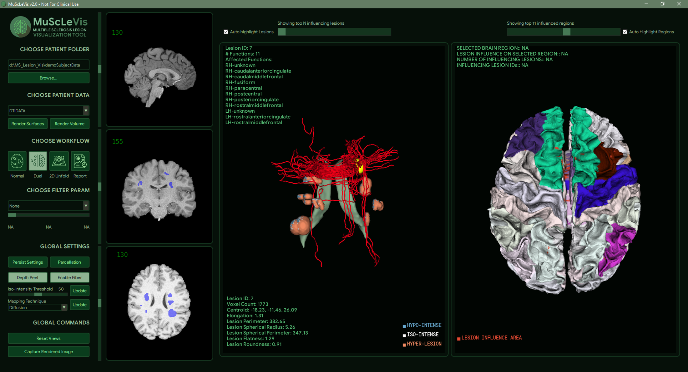

# Multiple Sclerosis Lesion Analysis Tool
## Interactive Visualization for Multiple Sclerosis Lesions 
Multiple Sclerosis (MS) is a brain disease that is diagnosed and monitored extensively through MRI scans. One of the criteria is the appearance of so-called brain lesions. The lesions show up on MRI scans as regions with elevated or reduced contrast compared to the surrounding healthy tissue. Understanding the complex interplay of contrast, location and shape in images from multiple modalities from 2D MRI slices is challenging. This python based tool is intended to provide advanced visualization of appearance- and location-related features of lesions that would help researchers in defining better disease characterization through MS research.

## Package requirements

a. vtk - https://anaconda.org/anaconda/vtk    (conda install -c anaconda vtk)  
b. itk - https://anaconda.org/conda-forge/itk  (conda install -c conda-forge itk)  
c. simpleitk - https://anaconda.org/SimpleITK/simpleitk  (conda install -c simpleitk simpleitk)  
d. nibabel - https://anaconda.org/conda-forge/nibabel  (conda install -c conda-forge nibabel)  
e. pip install freesurfer-surface 
